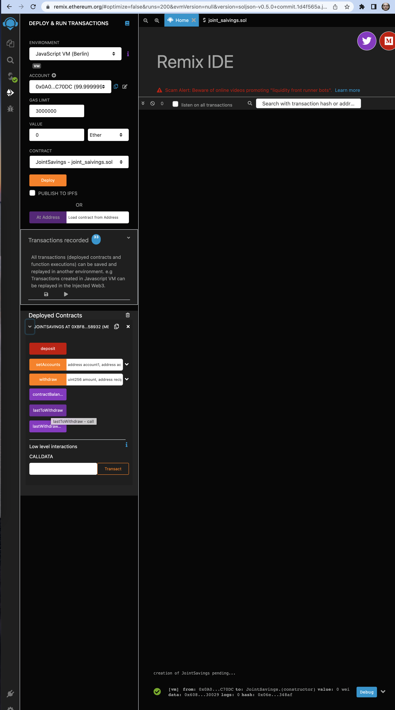
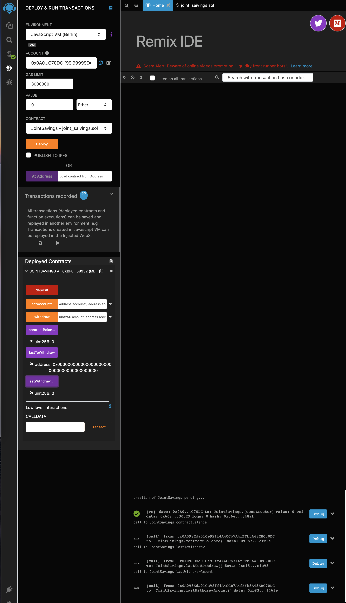
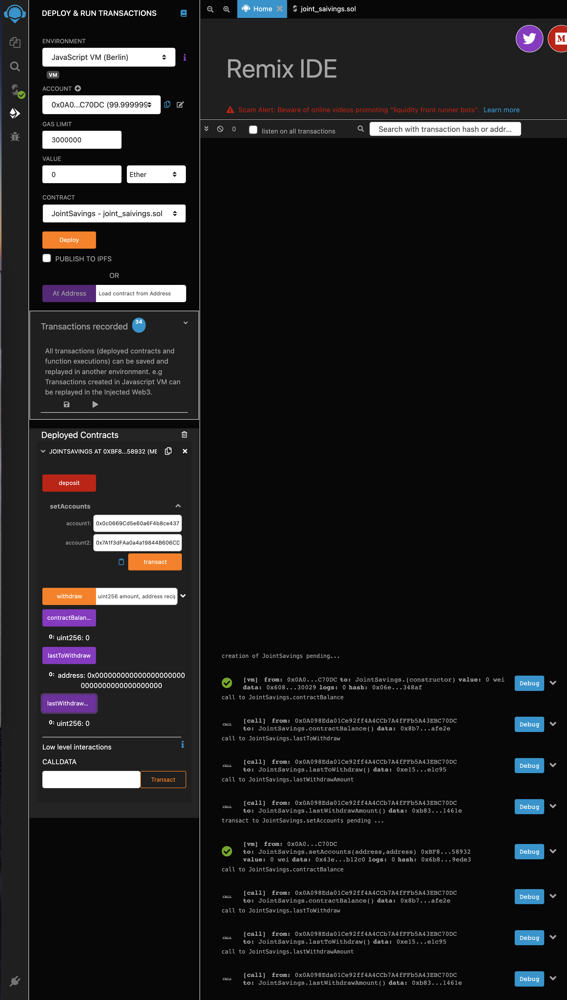
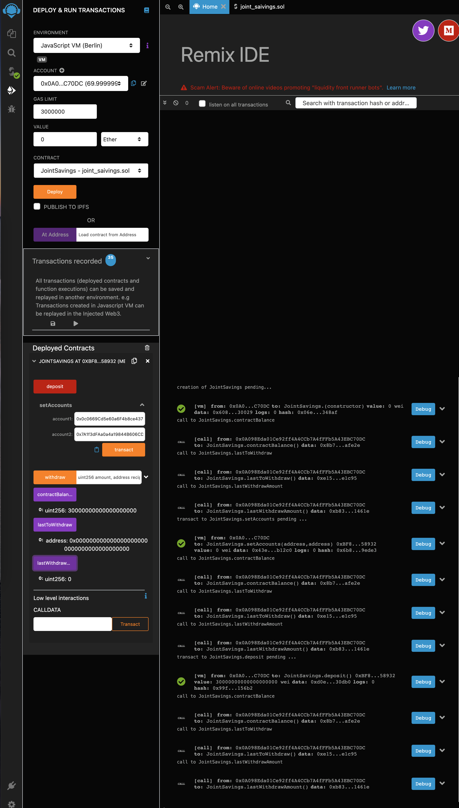
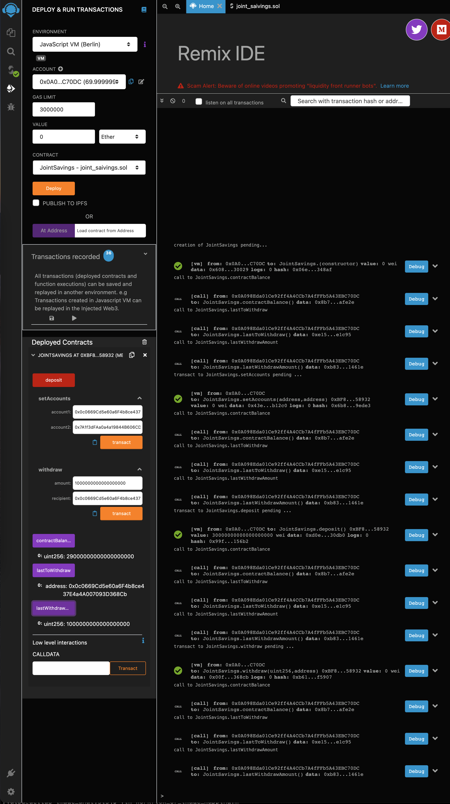
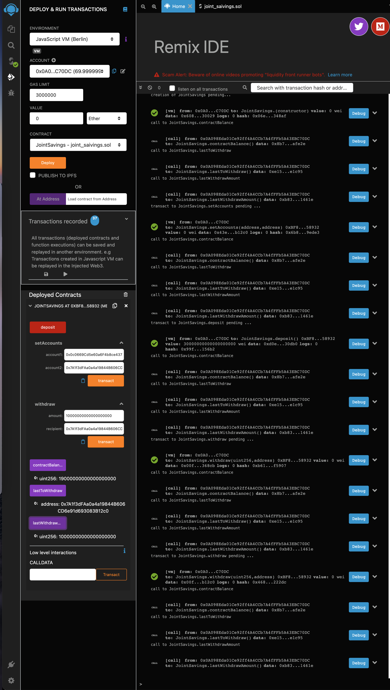
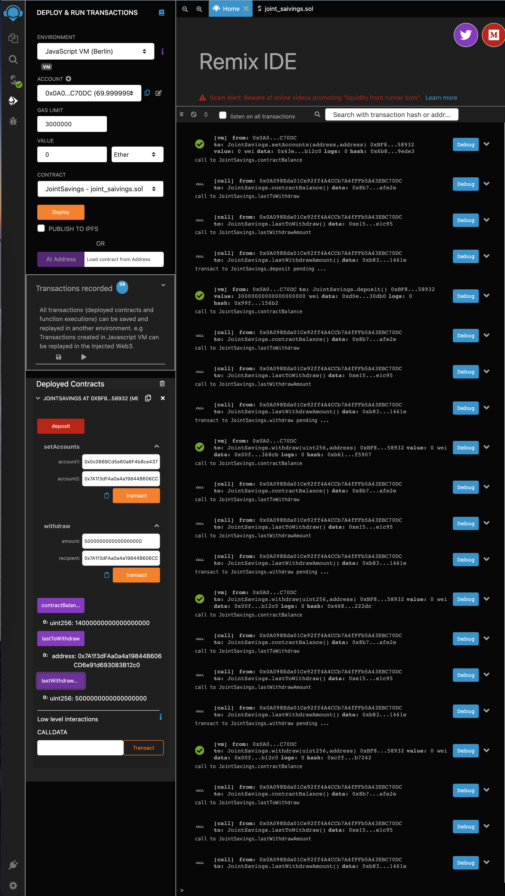
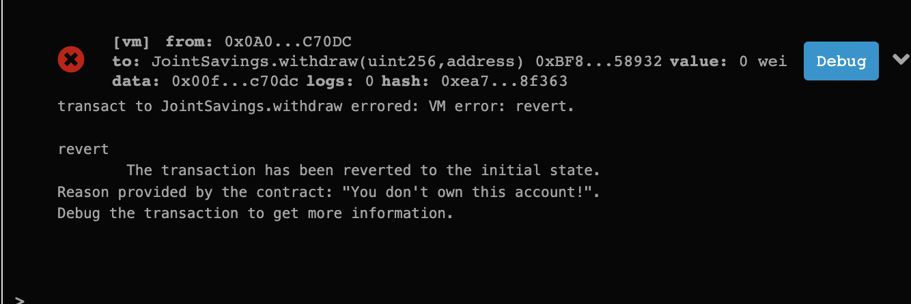
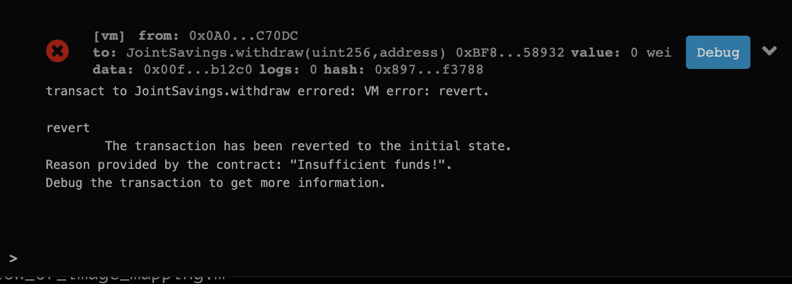

1.Once we deployed

2.Initial balance

3.Setting accounts

4.Initial Deposit

5.Transaction #1

6.Transaction #2

7.Transaction #3

8.Revertion due to the wrong account number

9.Revertion due to insufficient balance

